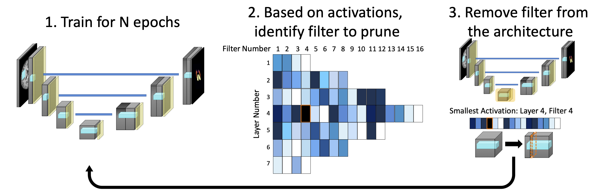

# STAMP: Simultaneous Training and Model Pruning
## Code for implementation of Simultaneous Model Pruning and Training for Low Data Regimes in Medical Image Segmentation

This is a working release. Any issues please contact: nicola.dinsdale@cs.ox.ac.uk. Further code will be added in time. 

Files
-----------------
- trainprune_main --> runs training procedure
  required arugments: 
  
    -m = pruning mode
    
    -r = number of recovery epochs
    
    -i = starting epoch
    
    -no = number of iterations to run
  
 

Software Versions 
-----------------
Python 3.5.2

PyTorch 1.0.1.post2
